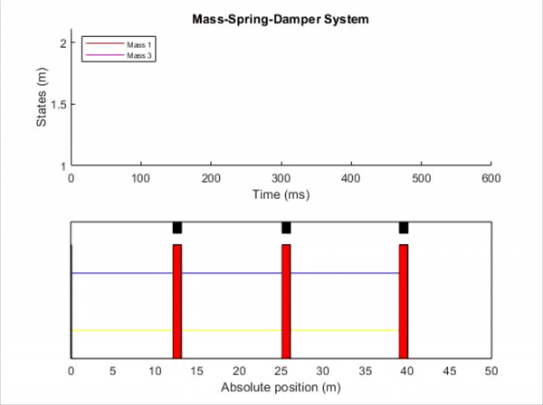
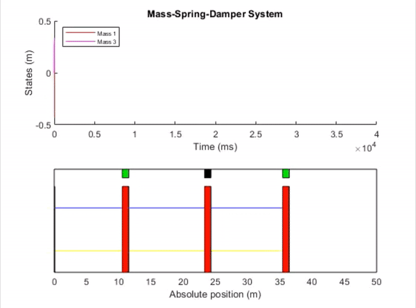
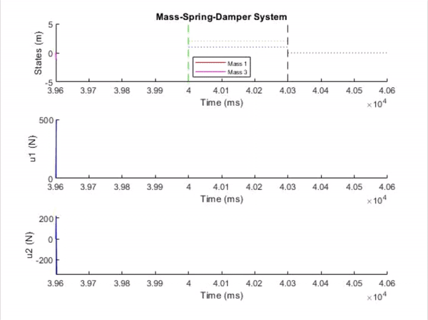

# Mass-Spring-Damper Simulation

### ***The codes are experimental for research purposes

This work presents control simulation of a mechanical system using a model-based reinforcement learning (RL) algorithm. It was meant only for data exploration, experimentation, visualization, and understanding the general approach behind MPC and RL. 

### Summary
- Integration of Model Predictive Control (MPC) and RL to control nonlinear MIMO system
- Utilization of neural networks for online prediction of the local dynamics 

Requirements:
- Python 3.8
- Tensorflow 2.3.0

## Problem Example

Suppose we have three identical point masses m = 0.5 kg, with initial positions x1, x2, and x3. The dampers have damping constant d= 0.25 N.s/m each. The springs are nonlinear, described by the Newton’s law as:

F(x) = k.Δx^3 + kp.Δx^3,

with k = 217 N/m, and kp= 63.5 N/m³. 

#### This problem is very unrealistic. The system is nonlinear and control starts at an extremely high frequency. This is the main challenge.

The neural network has to learn the dynamics function between control inputs, current positions, and past positions. For this exploration purpose in RL, the system is actuated randomly for 40 seconds. 

### Problem goal 
Steer the masses m1 and m3 to its desired reference position values x1_ref and x3_ref. An artificial neural network will be used to predict its future positions x1 and x3 based on the forces u1, dist, and u3.

There are two phases in RL: exploration and exploitation. For validation of online training, I did the following simulation for 40.6 seconds.

## Final results
Following proper design of reward function and neural network, the algorithm can control the system within 100 time steps.

## Outlook
The control algorithm takes about 4-5 seconds for each time step, because the computation is not optimized (GPU implementation not for all computation, but only for neural network training). Possible improvements for the future:
- Integration of a convex-input neural network to learn the whole system dynamics
- Rewrite code to make it valid for all MIMO systems, user-friendly application
- Implementation of proposed approach in computing platforms (e.g. OpenCL with C++)
- Experimental implementation of proposed approach on a real nonlinear MIMO system

## References
1. Hagan, M.T. ; Demuth, H.B. ; Jesus, O.d.: An introduction to the use of neural networks in control systems. In: Int. J. Robust Nonlinear Control Bd. 12. John Wiley and Sons Ltd, (2002), S. 959-985
2. Nagabandi, A. ; Kahn, G. ; Fearing, R.S. ; Levine, S.: Neural Network Dynamics for Model-Based Deep Reinforcement Learning with Model-Free Fine-Tuning. In: CoRR abs/1708.02596 (2017)
3. Chen, Y. ; Shi, Y. ; Zhang, B.: Optimal Control Via Neural Networks: A Convex Approach. In: arXiv: Optimization and Control (2019)
4. Sutton, RS. ; Barto, A.G.: Reinforcement Learning: An Introduction. Cambridge, MA, USA : A Bradford Book, (2018) — ISBN 0262039249
5. Wong, W. ; Chee, E. ; Li, J. ;Wang, X.: Recurrent Neural Network-Based Model Predictive Control for Continuous Pharmaceutical Manufacturing. In: Mathematics 6 (2018), S. 242
6. Rawlings, J. ; Mayne, D.Q. ; Diehl, M.: Model Predictive Control: Theory, Computation, and Design 2nd Edition. Santa Barbara, California: Nob Hill Publishing, LLC, (2019)
