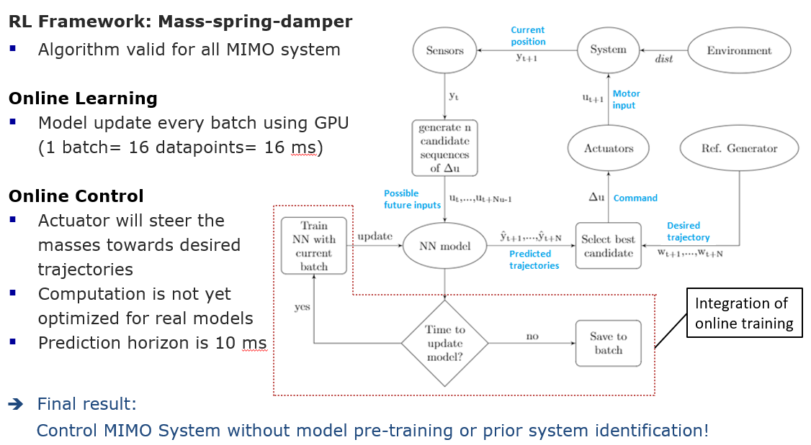
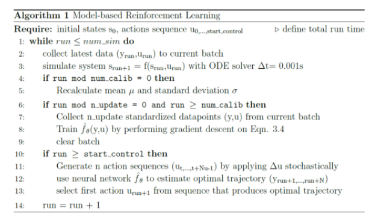

# Model-based RL Algorithm
Control simulation of a mechanical system using NN-MPC in a model-based reinforcement learning (RL) algorithm.

Suppose we have three identical point masses m = 0.5 kg, with initial positions x1, x2, and x3. The dampers have damping constant d= 0.25 N.s/m each. The springs are nonlinear, described by the Newton’s law as:

### F(x) = k.Δx^3 + kp.Δx^3,

with k = 217 N/m, and kp= 63.5 N/m³. 

#### The main goal here is to steer the masses m1 and m3 to its desired reference position values x1_ref and x3_ref. An artificial neural network will be used to predict its future positions x1 and x3 based on the forces u1, dist, and u3.

## Model-based RL Framework
Designed framework to solve the task

The pseudo algorithm to validate the framework is:

There are two phases in RL: exploration and exploitation.

First 40 seconds is exploration with random actions. Mass will be changed at 22 seconds to validate online learning capability. Control starts at 40 seconds (exploitation)

## Final results

